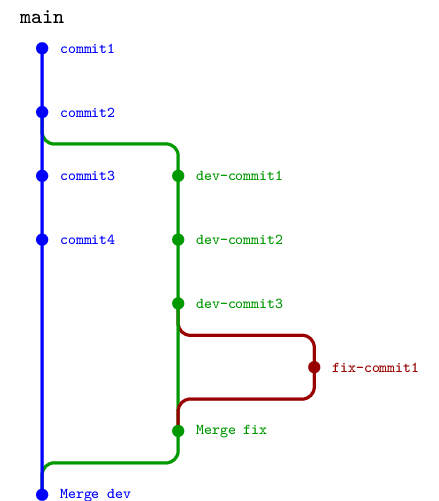

# tikzgitgraph

A LaTeX package for drawing Git-style commit graphs using TikZ.

## Features

- Declarative syntax: describe your repository history with four simple commands (`\repo`, `\commit`, `\branch`, `\merge`)
- Multiple branches with configurable colors and offsets
- Automatic fork elbows and merge lines
- Three merge routing modes to handle different branch length combinations
- Top-to-bottom and bottom-to-top layout directions

## Example of usage

```latex
\begin{gitgraph}
    \repo[main=true, color=blue, name=main]{main}{0,0}
        \commit{main}{commit1}
        \commit{main}{commit2}
        \branch{main:2}{dev}[color=green!60!black]
            \commit{dev}{dev-commit1}
            \commit{dev}{dev-commit2}
            \commit{dev}{dev-commit3}
            \branch{dev:3}{fix}[color=red!60!black]
                \commit{fix}{fix-commit1}
            \merge{dev}[childlonger]{fix:1}{Merge fix}
        \commit{main}{commit3}
        \commit{main}{commit4}
        \merge{main}[childlonger]{dev:4}{Merge dev}
\end{gitgraph}
```


## Requirements

- A LaTeX distribution including TikZ (e.g. TeX Live, MiKTeX)
- The `calc` TikZ library (loaded automatically by the package)

## Installation

Copy `tikzgitgraph.sty` into your project directory or into your local TeX tree.

## Documentation

See `tikzgitgraph.pdf` for the full user guide, covering all commands, available options, and worked examples.
